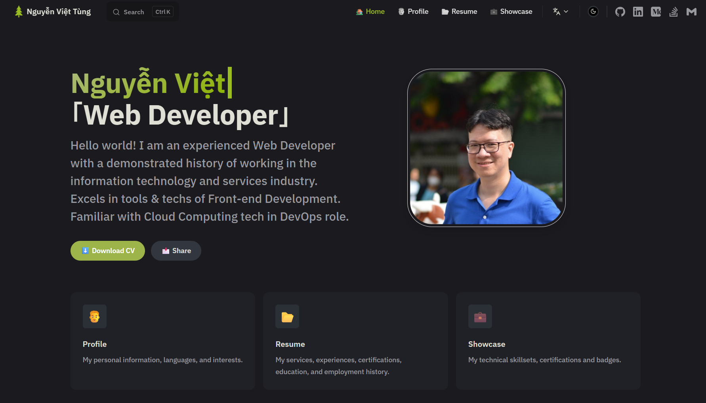

# CV Static Website

Personal CV and portfolio website built with [VitePress](https://vitepress.dev/).



## Current Scope

- Personal profile, services, bio, languages, and interests
- Resume and experience timeline
- Technical showcase (skills, projects, certifications)
- Bilingual content: English and Vietnamese
- Static assets for SEO and PWA metadata (manifest, robots, sitemap)
- Custom Vue-powered theme components for richer content sections

## Tech Stack

- VitePress 1.6
- Vue components inside the VitePress theme
- Sass for styling
- Icon processing utility via @iconify/utils

## Requirements

- Node.js 18+
- npm (or Bun)

## Setup

Install dependencies:

```sh
npm install
```

Optional (Bun):

```sh
bun install
```

Start local dev server (port 4173):

```sh
npm run docs:dev
```

Build static site:

```sh
npm run docs:build
```

Preview production build (port 8080):

```sh
npm run docs:preview
```

Build with explicit base path:

```sh
npm run docs:build -- --base "/"
```

## Content Map

- [docs/index.md](docs/index.md): Landing page
- [docs/profile.md](docs/profile.md): Profile section
- [docs/resume.md](docs/resume.md): Resume and certifications
- [docs/showcase.md](docs/showcase.md): Skills, projects, highlights
- [docs/vi/index.md](docs/vi/index.md): Vietnamese landing page
- [docs/vi/profile.md](docs/vi/profile.md): Vietnamese profile
- [docs/vi/resume.md](docs/vi/resume.md): Vietnamese resume
- [docs/vi/showcase.md](docs/vi/showcase.md): Vietnamese showcase

## Configuration and Theme

- [docs/.vitepress/config.mts](docs/.vitepress/config.mts): Site metadata, navigation, locales, search, footer
- [docs/.vitepress/theme/index.ts](docs/.vitepress/theme/index.ts): Theme extension and component registration
- [docs/.vitepress/theme/Layout.vue](docs/.vitepress/theme/Layout.vue): Layout wrapper
- [docs/.vitepress/theme/Timeline.vue](docs/.vitepress/theme/Timeline.vue): Timeline component
- [docs/.vitepress/theme/Grid.vue](docs/.vitepress/theme/Grid.vue): Grid component
- [docs/.vitepress/theme/Accordion.vue](docs/.vitepress/theme/Accordion.vue): Accordion component
- [docs/.vitepress/theme/Cert.vue](docs/.vitepress/theme/Cert.vue): Certification card component

## Static Assets

- [docs/public/content](docs/public/content): Downloadable CV and related files
- [docs/public/images](docs/public/images): Brand and cloud provider icon libraries
- [docs/public/manifest.json](docs/public/manifest.json): PWA metadata
- [docs/public/robots.txt](docs/public/robots.txt): Crawler directives
- [docs/public/sitemap.xml](docs/public/sitemap.xml): Search engine sitemap

## Project Structure

```text
docs/
  .vitepress/
    config.mts
    theme/
  components/
  public/
    content/
    images/
  vi/
  index.md
  profile.md
  resume.md
  showcase.md
package.json
tsconfig.json
```

## License

This repository is licensed under the [MIT License](LICENSE).
